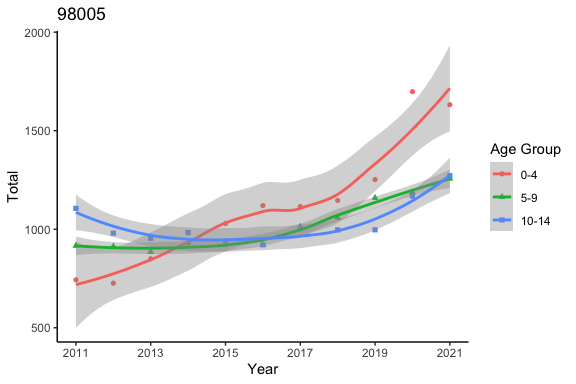
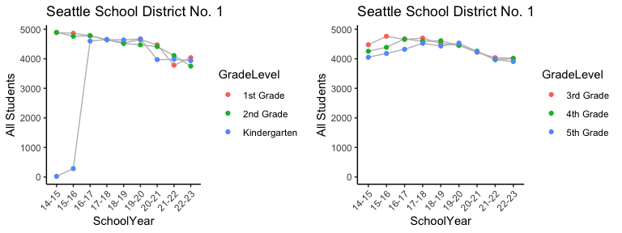

## Load R libraries

```r
library(data.table)
library(ggplot2)
library(ggpubr)
library(stringr)
library(readxl)
library(tidyr)

theme_set(theme_classic())
```

# Demographic data

## Demographic data from US Census


```r
years = 2011:2021
dat_all = NULL
zips  = 98004:98008

age_grp1 = paste0("Total!!Estimate!!AGE!!", 
                 c("Under 5 years", "5 to 9 years", "10 to 14 years"))

age_grp2 = paste0("Estimate!!Total!!Total population!!AGE!!", 
                 c("Under 5 years", "5 to 9 years", "10 to 14 years"))

for(y1 in years){
  dat = fread(sprintf("US_census/ACSST5Y%d.S0101-Data.csv", y1), skip=1)
  dim(dat)
  dat[1:5,1:3]

  
  if(y1 <= 2016){
    cols2use = c("Geographic Area Name", 
                 "Total!!Estimate!!Total population", 
                 age_grp1)
  }else{
    cols2use = c("Geographic Area Name", 
                 "Estimate!!Total!!Total population", 
                 age_grp2)
  }
  
  stopifnot(all(cols2use %in% names(dat)))

  dat = dat[,..cols2use]
  names(dat) = c("zipcode", "total", "0-4", "5-9", "10-14")
  dat$zipcode = gsub("ZCTA5 ", "", dat$zipcode)
  
  if(y1 <= 2016){
    dat[,3:5] = round(dat[,3:5]*dat$total/100)
  }
  
  dat = rbind(dat, data.table(zipcode="all", t(colSums(dat[,-1]))))
  print(y1)
  print(dat)
  dat$Year = y1

  dat_all = rbind(dat_all, dat)
}
```

```
## [1] 2011
##    zipcode  total  0-4  5-9 10-14
## 1:   98004  26754 1418 1204  1552
## 2:   98005  17276  743  916  1106
## 3:   98006  36878 1733 2766  2913
## 4:   98007  25231 1640 1489   934
## 5:   98008  24399 1391 1537  1440
## 6:     all 130538 6925 7912  7945
## [1] 2012
##    zipcode  total  0-4  5-9 10-14
## 1:   98004  27978 1371 1147  1511
## 2:   98005  16892  726  912   980
## 3:   98006  37858 1741 2801  3029
## 4:   98007  25434 1704 1348   941
## 5:   98008  24544 1399 1497  1399
## 6:     all 132706 6941 7705  7860
## [1] 2013
##    zipcode  total  0-4  5-9 10-14
## 1:   98004  30072 1714 1353  1594
## 2:   98005  17346  850  885   954
## 3:   98006  36327 1780 2579  2979
## 4:   98007  24926 1795 1446   922
## 5:   98008  24408 1318 1611  1342
## 6:     all 133079 7457 7874  7791
## [1] 2014
##    zipcode  total  0-4  5-9 10-14
## 1:   98004  31254 1750 1281  1625
## 2:   98005  17880  930  930   983
## 3:   98006  37059 1890 2372  2965
## 4:   98007  25521 2042 1276   944
## 5:   98008  24452 1247 1540  1492
## 6:     all 136166 7859 7399  8009
## [1] 2015
##    zipcode  total  0-4  5-9 10-14
## 1:   98004  32587 1727 1238  1695
## 2:   98005  17733 1029  922   940
## 3:   98006  37519 1989 2364  2814
## 4:   98007  26269 2207 1235   972
## 5:   98008  24751 1238 1683  1411
## 6:     all 138859 8190 7442  7832
## [1] 2016
##    zipcode  total  0-4  5-9 10-14
## 1:   98004  33124 1623 1491  1822
## 2:   98005  18059 1120  921   921
## 3:   98006  37819 1891 2307  2799
## 4:   98007  27050 2164 1596  1055
## 5:   98008  24763 1337 1733  1511
## 6:     all 140815 8135 8048  8108
## [1] 2017
##    zipcode  total  0-4  5-9 10-14
## 1:   98004  34283 1582 1442  2097
## 2:   98005  18735 1115 1013  1004
## 3:   98006  37231 1840 2210  2879
## 4:   98007  27954 2042 1613  1093
## 5:   98008  24822 1376 1780  1544
## 6:     all 143025 7955 8058  8617
## [1] 2018
##    zipcode  total  0-4  5-9 10-14
## 1:   98004  35034 1565 1375  2109
## 2:   98005  18765 1146 1059   997
## 3:   98006  37769 1869 2193  2767
## 4:   98007  29174 2106 1661  1263
## 5:   98008  25539 1436 1838  1551
## 6:     all 146281 8122 8126  8687
## [1] 2019
##    zipcode  total  0-4  5-9 10-14
## 1:   98004  36202 1692 1450  1958
## 2:   98005  19223 1252 1159   997
## 3:   98006  37871 1791 2305  2875
## 4:   98007  29322 2268 1730  1313
## 5:   98008  25719 1376 1761  1502
## 6:     all 148337 8379 8405  8645
## [1] 2020
##    zipcode  total  0-4  5-9 10-14
## 1:   98004  37265 1777 1878  1669
## 2:   98005  21414 1698 1187  1168
## 3:   98006  37473 1772 2407  2836
## 4:   98007  28147 2252 1806  1309
## 5:   98008  25650 1336 1485  1647
## 6:     all 149949 8835 8763  8629
## [1] 2021
##    zipcode  total  0-4  5-9 10-14
## 1:   98004  38632 1871 1906  1716
## 2:   98005  21603 1632 1257  1272
## 3:   98006  39595 1742 2381  3086
## 4:   98007  28576 1990 1661  1483
## 5:   98008  26091 1144 1584  1735
## 6:     all 154497 8379 8789  9292
```

```r
dim(dat_all)
```

```
## [1] 66  6
```

```r
dat_all[1:10,]
```

```
##     zipcode  total  0-4  5-9 10-14 Year
##  1:   98004  26754 1418 1204  1552 2011
##  2:   98005  17276  743  916  1106 2011
##  3:   98006  36878 1733 2766  2913 2011
##  4:   98007  25231 1640 1489   934 2011
##  5:   98008  24399 1391 1537  1440 2011
##  6:     all 130538 6925 7912  7945 2011
##  7:   98004  27978 1371 1147  1511 2012
##  8:   98005  16892  726  912   980 2012
##  9:   98006  37858 1741 2801  3029 2012
## 10:   98007  25434 1704 1348   941 2012
```

```r
df1 = pivot_longer(dat_all, cols=c("0-4", "5-9", "10-14"),
                   names_to = "Age Group", values_to = "Total")
df1 = as.data.frame(df1)
dim(df1)
```

```
## [1] 198   5
```

```r
df1[1:3,]
```

```
##   zipcode total Year Age Group Total
## 1   98004 26754 2011       0-4  1418
## 2   98004 26754 2011       5-9  1204
## 3   98004 26754 2011     10-14  1552
```

```r
df1$`Age Group` = factor(df1$`Age Group`, 
                         levels=c("0-4", "5-9", "10-14"))

for(zip1 in c(98004:98008, "all")){
  if(zip1 == "all"){gtitle = "98004-98008"}else{gtitle=zip1}
  df2 = df1[df1$zipcode==zip1,]
  p1 = ggplot(df2, aes(x=Year, y=Total, 
                          color=`Age Group`, shape=`Age Group`)) +
    geom_point() + geom_smooth(method=loess) + 
    scale_x_continuous("Year", seq(2011, 2021, by=2), 
                       seq(2011, 2021, by=2)) + 
    ggtitle(zip1)
  
  print(p1)
}
```

```
## `geom_smooth()` using formula = 'y ~ x'
```

<!-- -->

```
## `geom_smooth()` using formula = 'y ~ x'
```

<!-- -->

```
## `geom_smooth()` using formula = 'y ~ x'
```

<!-- -->

```
## `geom_smooth()` using formula = 'y ~ x'
```

<!-- -->

```
## `geom_smooth()` using formula = 'y ~ x'
```

<!-- -->

```
## `geom_smooth()` using formula = 'y ~ x'
```

<!-- -->

```r
df1[df1$zipcode == "all",]
```

```
##     zipcode  total Year Age Group Total
## 16      all 130538 2011       0-4  6925
## 17      all 130538 2011       5-9  7912
## 18      all 130538 2011     10-14  7945
## 34      all 132706 2012       0-4  6941
## 35      all 132706 2012       5-9  7705
## 36      all 132706 2012     10-14  7860
## 52      all 133079 2013       0-4  7457
## 53      all 133079 2013       5-9  7874
## 54      all 133079 2013     10-14  7791
## 70      all 136166 2014       0-4  7859
## 71      all 136166 2014       5-9  7399
## 72      all 136166 2014     10-14  8009
## 88      all 138859 2015       0-4  8190
## 89      all 138859 2015       5-9  7442
## 90      all 138859 2015     10-14  7832
## 106     all 140815 2016       0-4  8135
## 107     all 140815 2016       5-9  8048
## 108     all 140815 2016     10-14  8108
## 124     all 143025 2017       0-4  7955
## 125     all 143025 2017       5-9  8058
## 126     all 143025 2017     10-14  8617
## 142     all 146281 2018       0-4  8122
## 143     all 146281 2018       5-9  8126
## 144     all 146281 2018     10-14  8687
## 160     all 148337 2019       0-4  8379
## 161     all 148337 2019       5-9  8405
## 162     all 148337 2019     10-14  8645
## 178     all 149949 2020       0-4  8835
## 179     all 149949 2020       5-9  8763
## 180     all 149949 2020     10-14  8629
## 196     all 154497 2021       0-4  8379
## 197     all 154497 2021       5-9  8789
## 198     all 154497 2021     10-14  9292
```


## Demographic data from censusreporter

> Census Reporter is an independent project to make data from the American Community Survey (ACS) easier to use. We are unaffiliated with the U.S. Census Bureau.

* B01001003: "Under 5 years"
* B01001004: "5 to 9 years"
* B01001005: "10 to 14 years"

We comapre 1 year vs. 5 year estimate with confidence intervals. Here are the official statemet of the two estimates

https://www.census.gov/programs-surveys/acs/guidance/estimates.html

1 year estimate: Best used when currency is more important than precision Analyzing large populations

5 year estimate: Best used when precision is more important than currency, analyzing very small populations, examining tracts and other smaller geographies because 1-year estimates are not available

> The MOEs for published ACS estimates are provided at a 90 percent
confidence level.


```r
dir_5y  = "acs2021_5yr_B01001_15000US530330228033"
file_5y = "acs2021_5yr_B01001_15000US530330228033.csv"

dat_5y = fread(file.path("censusreporter", dir_5y, file_5y))
dim(dat_5y)
```

```
## [1] 125 100
```

```r
dat_5y[c(1:2, nrow(dat_5y)),1:12]
```

```
##                  geoid                         name B01001001 B01001001, Error
## 1: 15000US530330041011  BG 1, Tract 41.01, King, WA      1064              265
## 2: 15000US530330041012  BG 2, Tract 41.01, King, WA      1917              578
## 3:      97000US5300390 Bellevue School District, WA    144956             1921
##    B01001002 B01001002, Error B01001003 B01001003, Error B01001004
## 1:       534              152        31               28        23
## 2:      1058              398        21               27       102
## 3:     74464             1392      4385              589      4409
##    B01001004, Error B01001005 B01001005, Error
## 1:               26        90               78
## 2:              115       120               81
## 3:              512      4767              544
```

```r
cols_total = c("B01001003", "B01001004", "B01001005")
cols_error = paste0(cols_total, ", Error")

nr = nrow(dat_5y)

bsd_5y = data.frame(age = c("0-4", "5-9", "10-14"), 
                    total = unlist(dat_5y[nr, ..cols_total]), 
                    error = unlist(dat_5y[nr, ..cols_error]))

dir_1y  = "acs2021_1yr_B01001_97000US5300390"
file_1y = "acs2021_1yr_B01001_97000US5300390.csv"

dat_1y = fread(file.path("censusreporter", dir_1y, file_1y))
dim(dat_1y)
```

```
## [1]   1 100
```

```r
dat_1y[,1:12]
```

```
##             geoid                         name B01001001 B01001001, Error
## 1: 97000US5300390 Bellevue School District, WA    144015             3382
##    B01001002 B01001002, Error B01001003 B01001003, Error B01001004
## 1:     74794             3021      3352             1298      5139
##    B01001004, Error B01001005 B01001005, Error
## 1:             1277      4841             1022
```

```r
bsd_1y = data.frame(age = c("0-4", "5-9", "10-14"), 
                    total = unlist(dat_1y[1, ..cols_total]), 
                    error = unlist(dat_1y[1, ..cols_error]))
bsd_1y$method = "US Census 1 year estimate"
bsd_5y$method = "US Census 5 year estimate"

bsd = rbind(bsd_1y, bsd_5y)
bsd$age = factor(bsd$age, levels = c("0-4", "5-9", "10-14"))

ci_ratio = qnorm(0.975)/qnorm(0.95)
ci_ratio
```

```
## [1] 1.191573
```

```r
ggplot(bsd, aes(x = age, y = total, fill=method)) +
  geom_bar(stat = "identity", position=position_dodge()) +
  geom_errorbar(aes(ymin = total - ci_ratio*error, 
                    ymax = total + ci_ratio*error),
                width = 0.2, position = position_dodge(0.9)) +
  labs(title = "BSD: US census total and 95% confidence interval")
```

<!-- -->

```r
bsd = data.table(bsd)
bsd[,CI:=paste0(round(total - ci_ratio*error), "-", 
                round(total + ci_ratio*error))]

bsd
```

```
##      age total error                    method        CI
## 1:   0-4  3352  1298 US Census 1 year estimate 1805-4899
## 2:   5-9  5139  1277 US Census 1 year estimate 3617-6661
## 3: 10-14  4841  1022 US Census 1 year estimate 3623-6059
## 4:   0-4  4385   589 US Census 5 year estimate 3683-5087
## 5:   5-9  4409   512 US Census 5 year estimate 3799-5019
## 6: 10-14  4767   544 US Census 5 year estimate 4119-5415
```

# Enrollment data


```r
fnm = "Report_Card_Enrollment_from_2014-15_to_Current_Year.csv"
dat = fread(paste0("Report_Card_Enrollment/", fnm))

dim(dat)
```

```
## [1] 161995     45
```

```r
dat[1:2,]
```

```
##    SchoolYear OrganizationLevel   County     ESDName ESDOrganizationID
## 1:    2021-22             State Multiple State Total                NA
## 2:    2020-21             State Multiple State Total                NA
##    DistrictCode DistrictName DistrictOrganizationId SchoolCode  SchoolName
## 1:           NA  State Total                     NA         NA State Total
## 2:           NA  State Total                     NA         NA State Total
##    SchoolOrganizationid CurrentSchoolType Gradelevel All Students Female   Male
## 1:                   NA                   10th Grade       84,871 40,794 43,600
## 2:                   NA                   10th Grade       83,602 40,204 43,073
##    Gender X American Indian/ Alaskan Native Asian Black/ African American
## 1:      477                           1,063 6,894                   3,827
## 2:      325                           1,084 6,996                   3,665
##    Hispanic/ Latino of any race(s) Native Hawaiian/ Other Pacific Islander
## 1:                          21,364                                   1,044
## 2:                          20,321                                   1,071
##    Two or More Races  White English Language Learners Highly Capable Homeless
## 1:             7,367 43,311                     7,806           5900    2,137
## 2:             6,872 43,593                     7,930           5804    2,066
##    Low-Income Migrant Military Parent Mobile Section 504
## 1:     38,509   1,880           1,774  1,538       5,698
## 2:     36,941   1,875           1,455  1,222       5,755
##    Students with Disabilities Non-English Language Learners Non-Highly Capable
## 1:                     10,565                        77,065              78971
## 2:                     10,497                        75,672              77798
##    Non-Homeless Non-Low Income Non Migrant Non Military Parent Non Mobile
## 1:       82,734         46,362      82,991              83,097     83,333
## 2:       81,536         46,661      81,727              82,147     82,380
##    Non Section 504 Students without Disabilities               DataAsOf
## 1:          79,173                        74,306 04/22/2022 12:00:00 AM
## 2:          77,847                        73,105 04/22/2022 12:00:00 AM
##    FosterCare Non-FosterCare
## 1:        316          84555
## 2:        379          83223
```

```r
table(dat$SchoolYear)
```

```
## 
## 2014-15 2015-16 2016-17 2017-18 2018-19 2019-20 2020-21 2021-22 
##   20310   20328   20331   19906   19974   20112   20341   20693
```

```r
table(dat$OrganizationLevel)
```

```
## 
## District   School    State 
##    35995   125872      128
```

```r
table(dat$DistrictName == "Bellevue School District")
```

```
## 
##  FALSE   TRUE 
## 160204   1791
```

```r
bsd = dat[DistrictName == "Bellevue School District",]
dim(bsd)
```

```
## [1] 1791   45
```

```r
bsd[1:2,]
```

```
##    SchoolYear OrganizationLevel County
## 1:    2021-22            School   King
## 2:    2020-21            School   King
##                                         ESDName ESDOrganizationID DistrictCode
## 1: Puget Sound Educational Service District 121            100006        17405
## 2: Puget Sound Educational Service District 121            100006        17405
##                DistrictName DistrictOrganizationId SchoolCode
## 1: Bellevue School District                 100019       3633
## 2: Bellevue School District                 100019       3633
##                   SchoolName SchoolOrganizationid CurrentSchoolType Gradelevel
## 1: Ardmore Elementary School               101386                 P  1st Grade
## 2: Ardmore Elementary School               101386                 P  1st Grade
##    All Students Female Male Gender X American Indian/ Alaskan Native Asian
## 1:           63     36   27        0                               1    36
## 2:           68     31   37        0                               0    38
##    Black/ African American Hispanic/ Latino of any race(s)
## 1:                       7                               7
## 2:                       4                              10
##    Native Hawaiian/ Other Pacific Islander Two or More Races White
## 1:                                       0                 3     9
## 2:                                       0                 2    14
##    English Language Learners Highly Capable Homeless Low-Income Migrant
## 1:                        32              0        0         19       0
## 2:                        48              1        1         21       0
##    Military Parent Mobile Section 504 Students with Disabilities
## 1:               0      8           0                          3
## 2:               0      9           0                          4
##    Non-English Language Learners Non-Highly Capable Non-Homeless Non-Low Income
## 1:                            31                 63           63             44
## 2:                            20                 67           67             47
##    Non Migrant Non Military Parent Non Mobile Non Section 504
## 1:          63                  63         55              63
## 2:          68                  68         59              68
##    Students without Disabilities               DataAsOf FosterCare
## 1:                            60 04/22/2022 12:00:00 AM          0
## 2:                            64 04/22/2022 12:00:00 AM          0
##    Non-FosterCare
## 1:             63
## 2:             68
```

```r
table(bsd$SchoolName)
```

```
## 
##                     Ardmore Elementary School 
##                                            64 
##                   Bellevue Big Picture School 
##                                            64 
##                          Bellevue High School 
##                                            40 
##                     Bennett Elementary School 
##                                            66 
## Career Education Options Reengagement Program 
##                                            19 
##                  Central Educational Services 
##                                            97 
##                Cherry Crest Elementary School 
##                                            64 
##                         Chinook Middle School 
##                                            32 
##                         Clyde Hill Elementary 
##                                            63 
##                                District Total 
##                                           127 
##                    Eastgate Elementary School 
##                                            64 
##                      Enatai Elementary School 
##                                            64 
##                        Highland Middle School 
##                                            33 
##                  Interlake Senior High School 
##                                            40 
##                          International School 
##                                            64 
##                    Jing Mei Elementary School 
##                                            60 
##                         Lake Hills Elementary 
##                                            63 
##                      Medina Elementary School 
##                                            62 
##                    Newport Heights Elementary 
##                                            60 
##                    Newport Senior High School 
##                                            40 
##                            Odle Middle School 
##                                            32 
##                       Phantom Lake Elementary 
##                                            66 
##              Puesta del Sol Elementary School 
##                                            63 
##                         Sammamish Senior High 
##                                            40 
##                    Sherwood Forest Elementary 
##                                            65 
##                    Somerset Elementary School 
##                                            58 
##                 Spiritridge Elementary School 
##                                            59 
##                          Stevenson Elementary 
##                                            63 
##                        Tillicum Middle School 
##                                            32 
##                            Tyee Middle School 
##                                            32 
##                   Wilburton Elementary School 
##                                            34 
##                          Woodridge Elementary 
##                                            61
```

```r
bsd_total = bsd[SchoolName == "District Total",]
somerset  = bsd[SchoolName == "Somerset Elementary School",]

dim(bsd_total)
```

```
## [1] 127  45
```

```r
dim(somerset)
```

```
## [1] 58 45
```

```r
bsd_total[1:2,]
```

```
##    SchoolYear OrganizationLevel County
## 1:    2021-22          District   King
## 2:    2020-21          District   King
##                                         ESDName ESDOrganizationID DistrictCode
## 1: Puget Sound Educational Service District 121            100006        17405
## 2: Puget Sound Educational Service District 121            100006        17405
##                DistrictName DistrictOrganizationId SchoolCode     SchoolName
## 1: Bellevue School District                 100019         NA District Total
## 2: Bellevue School District                 100019         NA District Total
##    SchoolOrganizationid CurrentSchoolType Gradelevel All Students Female Male
## 1:                   NA                   10th Grade        1,645    778  861
## 2:                   NA                   10th Grade        1,651    780  868
##    Gender X American Indian/ Alaskan Native Asian Black/ African American
## 1:        6                               0   676                      58
## 2:        3                               3   668                      47
##    Hispanic/ Latino of any race(s) Native Hawaiian/ Other Pacific Islander
## 1:                             204                                       3
## 2:                             202                                       5
##    Two or More Races White English Language Learners Highly Capable Homeless
## 1:               167   537                       132            321       15
## 2:               153   573                       119            299       22
##    Low-Income Migrant Military Parent Mobile Section 504
## 1:        309       1              18     17         187
## 2:        270       1              14     22         193
##    Students with Disabilities Non-English Language Learners Non-Highly Capable
## 1:                        145                         1,513               1324
## 2:                        137                         1,532               1352
##    Non-Homeless Non-Low Income Non Migrant Non Military Parent Non Mobile
## 1:        1,630          1,336       1,644               1,627      1,628
## 2:        1,629          1,381       1,650               1,637      1,629
##    Non Section 504 Students without Disabilities               DataAsOf
## 1:           1,458                         1,500 04/22/2022 12:00:00 AM
## 2:           1,458                         1,514 04/22/2022 12:00:00 AM
##    FosterCare Non-FosterCare
## 1:          0           1645
## 2:          0           1649
```

```r
table(bsd_total$SchoolYear)
```

```
## 
## 2014-15 2015-16 2016-17 2017-18 2018-19 2019-20 2020-21 2021-22 
##      16      16      16      16      16      16      15      16
```

```r
table(somerset$SchoolYear)
```

```
## 
## 2014-15 2015-16 2016-17 2017-18 2018-19 2019-20 2020-21 2021-22 
##       8       8       7       7       7       7       7       7
```

```r
bsd_total[SchoolYear=="2014-15", Gradelevel]
```

```
##  [1] "10th Grade"            "11th Grade"            "12th Grade"           
##  [4] "1st Grade"             "2nd Grade"             "3rd Grade"            
##  [7] "4th Grade"             "5th Grade"             "6th Grade"            
## [10] "7th Grade"             "8th Grade"             "9th Grade"            
## [13] "AllGrades"             "Half-day Kindergarten" "Kindergarten"         
## [16] "Pre-Kindergarten"
```

```r
bsd_total[SchoolYear=="2020-21", Gradelevel]
```

```
##  [1] "10th Grade"       "11th Grade"       "12th Grade"       "1st Grade"       
##  [5] "2nd Grade"        "3rd Grade"        "4th Grade"        "5th Grade"       
##  [9] "6th Grade"        "7th Grade"        "8th Grade"        "9th Grade"       
## [13] "AllGrades"        "Kindergarten"     "Pre-Kindergarten"
```

```r
somerset[SchoolYear=="2014-15", Gradelevel]
```

```
## [1] "1st Grade"             "2nd Grade"             "3rd Grade"            
## [4] "4th Grade"             "5th Grade"             "AllGrades"            
## [7] "Half-day Kindergarten" "Kindergarten"
```

```r
somerset[SchoolYear=="2021-22", Gradelevel]
```

```
## [1] "1st Grade"    "2nd Grade"    "3rd Grade"    "4th Grade"    "5th Grade"   
## [6] "AllGrades"    "Kindergarten"
```

```r
grads = somerset[SchoolYear=="2021-22", Gradelevel]
grads = setdiff(grads, "AllGrades")

grads
```

```
## [1] "1st Grade"    "2nd Grade"    "3rd Grade"    "4th Grade"    "5th Grade"   
## [6] "Kindergarten"
```

```r
fnm = "Report_Card_Enrollment_2022-23_School_Year.csv"
dat_23 = fread(paste0("Report_Card_Enrollment/", fnm))
dim(dat_23)
```

```
## [1] 20512    45
```

```r
dat_23[1:2,]
```

```
##    schoolyear OrganizationLevel County                          ESDName
## 1:    2022-23            School  Adams Educational Service District 123
## 2:    2022-23            School  Adams Educational Service District 123
##    ESDOrganizationID DistrictCode            DistrictName
## 1:            100007        1,147 Othello School District
## 2:            100007        1,147 Othello School District
##    DistrictOrganizationId SchoolCode               SchoolName
## 1:                 100192      5,367 Desert Oasis High School
## 2:                 100192      5,367 Desert Oasis High School
##    SchoolOrganizationid CurrentSchoolType GradeLevel All Students Female
## 1:               105795                 A 10th Grade           20     11
## 2:               105795                 A 11th Grade           36     21
##    Gender X Male American Indian/ Alaskan Native Asian Black/ African American
## 1:        0    9                               0     0                       0
## 2:        0   15                               0     0                       0
##    Hispanic/ Latino of any race(s) Native Hawaiian/ Other Pacific Islander
## 1:                              19                                       0
## 2:                              33                                       0
##    Two or More Races White English Language Learners Foster Care Highly Capable
## 1:                 0     1                         5           0              0
## 2:                 0     3                        21           0              0
##    Homeless Low-Income Migrant Military Parent Mobile Section 504
## 1:        2         18       4               0      2           1
## 2:        0         30       1               0      2           2
##    Students with Disabilities Non-English Language Learners Non-Foster Care
## 1:                          0                            15              20
## 2:                          0                            15              36
##    Non-Highly Capable Non-Homeless Non-Low Income Non Migrant
## 1:                 20           18              2          16
## 2:                 36           36              6          35
##    Non Military Parent Non Mobile Non Section 504 Students without Disabilities
## 1:                  20         18              19                            20
## 2:                  36         34              34                            36
##                  DataAsOf
## 1: 01/30/2023 12:00:00 AM
## 2: 01/30/2023 12:00:00 AM
```

```r
names(dat_23)[names(dat_23)=="schoolyear"] = "SchoolYear"
names(dat)[names(dat)=="Gradelevel"] = "GradeLevel"

cols = c("SchoolYear", "DistrictName", "SchoolName", 
         "GradeLevel", "All Students")
table(cols %in% names(dat))
```

```
## 
## TRUE 
##    5
```

```r
table(cols %in% names(dat_23))
```

```
## 
## TRUE 
##    5
```

```r
dat = rbind(dat[,..cols], dat_23[,..cols])
dim(dat)
```

```
## [1] 182507      5
```

```r
dat[1:2,]
```

```
##    SchoolYear DistrictName  SchoolName GradeLevel All Students
## 1:    2021-22  State Total State Total 10th Grade       84,871
## 2:    2020-21  State Total State Total 10th Grade       83,602
```

## Summarize one school district


```r
plot_district <- function(dat, school_district, grads){
  
  grads_grp1 = grads[c(1,2,6)]
  grads_grp2 = grads[3:5]

  district = dat[DistrictName == school_district]
  district = district[SchoolName == "District Total",]
  district = district[GradeLevel %in% grads,]
  district$SchoolYear = gsub("^20", "", district$SchoolYear)
  district$`All Students` = as.numeric(gsub(",", "", 
                                            district$`All Students`))
  
  p1 = ggplot(subset(district, GradeLevel %in% grads_grp1), 
              aes(x=SchoolYear, y=`All Students`, 
                          color=GradeLevel, group=GradeLevel)) +
    geom_line(color="grey") + geom_point() + 
    ylim(0, max(district$`All Students`)) + 
    ggtitle(school_district) + 
    theme(axis.text.x = element_text(angle = 45, hjust = 1))
  
  p2 = ggplot(subset(district, GradeLevel %in% grads_grp2), 
              aes(x=SchoolYear, y=`All Students`, 
                          color=GradeLevel, group=GradeLevel)) +
    geom_line(color="grey") + geom_point() +  
    ylim(0, max(district$`All Students`)) + 
    ggtitle(school_district) + 
    theme(axis.text.x = element_text(angle = 45, hjust = 1))

  ggarrange(p1, p2, nrow=1, ncol=2)
}

plot_district(dat, "Bellevue School District", grads)
```

<!-- -->

```r
plot_district(dat, "Seattle School District No. 1", grads)
```

<!-- -->

```r
plot_district(dat, "Lake Washington School District", grads)
```

<!-- -->

```r
plot_district(dat, "Issaquah School District", grads)
```

<!-- -->

## Summarize one school


```r
plot_school <- function(dat, school, grads){
  
  grads_grp1 = grads[c(1,2,6)]
  grads_grp2 = grads[3:5]

  df = dat[SchoolName == school & DistrictName=="Bellevue School District",]
  df = df[GradeLevel %in% grads,]
  df$SchoolYear = gsub("^20", "", df$SchoolYear)
  df$`All Students` = as.numeric(gsub(",", "", 
                                      df$`All Students`))
  
  p1 = ggplot(subset(df, GradeLevel %in% grads_grp1), 
              aes(x=SchoolYear, y=`All Students`, 
                          color=GradeLevel, group=GradeLevel)) +
    geom_line(color="grey") + geom_point() +  
    ylim(0, max(df$`All Students`)) + 
    ggtitle(school) + 
    theme(axis.text.x = element_text(angle = 45, hjust = 1))

  p2 = ggplot(subset(df, GradeLevel %in% grads_grp2), 
              aes(x=SchoolYear, y=`All Students`, 
                          color=GradeLevel, group=GradeLevel)) +
    geom_line(color="grey") + geom_point() +  
    ylim(0, max(df$`All Students`)) + 
    ggtitle(school) + 
    theme(axis.text.x = element_text(angle = 45, hjust = 1))

  ggarrange(p1, p2, nrow=1, ncol=2)
}

table(dat$SchoolName[dat$DistrictName == "Bellevue School District" & 
                     dat$GradeLevel == "1st Grade"])
```

```
## 
##        Ardmore Elementary School       Bellevue Digital Discovery 
##                                9                                1 
##        Bennett Elementary School     Central Educational Services 
##                                9                                6 
##   Cherry Crest Elementary School            Clyde Hill Elementary 
##                                9                                9 
##                   District Total       Eastgate Elementary School 
##                                9                                9 
##         Enatai Elementary School       Jing Mei Elementary School 
##                                9                                9 
##            Lake Hills Elementary         Medina Elementary School 
##                                9                                9 
##       Newport Heights Elementary          Phantom Lake Elementary 
##                                9                                9 
## Puesta del Sol Elementary School       Sherwood Forest Elementary 
##                                9                                9 
##       Somerset Elementary School    Spiritridge Elementary School 
##                                9                                9 
##             Stevenson Elementary      Wilburton Elementary School 
##                                9                                5 
##             Woodridge Elementary 
##                                9
```

```r
plot_school(dat, "Somerset Elementary School", grads)
```

<!-- -->

```r
plot_school(dat, "Eastgate Elementary School", grads)
```

<!-- -->

```r
plot_school(dat, "Jing Mei Elementary School", grads)
```

<!-- -->

```r
plot_school(dat, "Medina Elementary School", grads)
```

<!-- -->

```r
plot_school(dat, "Wilburton Elementary School", grads)
```

<!-- -->

```r
plot_school(dat, "Cherry Crest Elementary School", grads)
```

<!-- -->

# Appendix

## Demographic data from Washington state OFM

Small Area Demographic Estimates (SADE) by School district, downloaded from Office of Financial Management (OFM) [website](https://ofm.wa.gov/washington-data-research/population-demographics/population-estimates/estimates-april-1-population-age-sex-race-and-hispanic-origin). 

Note that this data may not be accurate since as mentioned in the OFM website: 

> OFM 2011 through 2020 estimates are based on 2010 census data. Results from the 2020 Census are not available yet. OFM Small Area Demographic Estimates from 2011 forward will be revised after detailed 2020 Census data are released.


```r
sade = read_excel("ofm_pop_sade_sduni_2010_to_2020.xlsx", 
                         sheet = "Total")
dim(sade)
```

```
## [1] 65119    25
```

```r
sade[1:2,]
```

```
## # A tibble: 2 × 25
##   `Area Name` `Area ID` Year  `Age Group` Total  Male   Female `White Total`
##   <chr>       <chr>     <chr> <chr>       <chr>  <chr>  <chr>  <chr>        
## 1 Washington  53        2010  0-4         439657 225088 214569 330767       
## 2 Washington  53        2010  5-9         429877 219702 210175 328738       
## # … with 17 more variables: White Male <chr>, White Female <chr>,
## #   Black Total <chr>, Black Male <chr>, Black Female <chr>, AIAN Total <chr>,
## #   AIAN Male <chr>, AIAN Female <chr>, Asian Total <chr>, Asian Male <chr>,
## #   Asian Female <chr>, NHOPI Total <chr>, NHOPI Male <chr>,
## #   NHOPI Female <chr>, Two or More Races Total <chr>,
## #   Two or More Races Male <chr>, Two or More Races Female <chr>
```

```r
school_districts = c("Bellevue School District", 
                    "Lake Washington School District", 
                    "Issaquah School District",
                    "Seattle School District")

stopifnot(all(school_districts %in% sade$`Area Name`))

sade = sade[sade$`Area Name` %in% school_districts,]
table(sade$`Age Group`)
```

```
## 
##   0-4 10-14 15-19 20-24 25-29 30-34 35-39 40-44 45-49   5-9 50-54 55-59 60-64 
##    44    44    44    44    44    44    44    44    44    44    44    44    44 
## 65-69 70-74 75-79 80-84   85+ Total 
##    44    44    44    44    44    44
```

```r
sade = as.data.table(sade[,1:7])

age_groups = c("0-4", "5-9", "10-14", "30-34", "35-39", "40-44", "45-49")
sade = sade[`Age Group` %in% age_groups, ]

table(sade$`Area Name`)
```

```
## 
##        Bellevue School District        Issaquah School District 
##                              77                              77 
## Lake Washington School District         Seattle School District 
##                              77                              77
```

```r
table(sade$Year)
```

```
## 
## 2010 2011 2012 2013 2014 2015 2016 2017 2018 2019 2020 
##   28   28   28   28   28   28   28   28   28   28   28
```

```r
sade[1:2,]
```

```
##                   Area Name Area ID Year Age Group   Total    Male  Female
## 1: Bellevue School District 5300390 2010       0-4 7026.63 3582.98 3443.66
## 2: Bellevue School District 5300390 2010       5-9 7403.91  3788.1 3615.81
```

```r
sade$Year   = as.numeric(sade$Year)
sade$Total  = as.numeric(sade$Total)
sade$Male   = as.numeric(sade$Male)
sade$Female = as.numeric(sade$Female)

sade$Age_set = "Young_adults"
sade[`Age Group` %in% c("0-4", "5-9", "10-14"), Age_set:= "kids"]

dim(sade)
```

```
## [1] 308   8
```

```r
sade[1:2,]
```

```
##                   Area Name Area ID Year Age Group   Total    Male  Female
## 1: Bellevue School District 5300390 2010       0-4 7026.63 3582.98 3443.66
## 2: Bellevue School District 5300390 2010       5-9 7403.91 3788.10 3615.81
##    Age_set
## 1:    kids
## 2:    kids
```

```r
sade$`Age Group` = factor(sade$`Age Group`, 
                                 levels=age_groups)
```

### Bellevue

```r
plot1 <- function(df, age, area){
  df1 = df[df$Age_set == age & df$`Area Name` == area, ]
  g1 = ggplot(df1, aes(x=Year, y=Total, color=`Age Group`, shape=`Age Group`)) +
    geom_point() + geom_smooth(method=loess) + 
    scale_x_continuous("Year", seq(2010, 2020, by=2), seq(2010, 2020, by=2)) + 
    ggtitle(area)
  g1
}

g1 = plot1(sade, age="kids", area="Bellevue School District")
g2 = plot1(sade, age="Young_adults", area="Bellevue School District")

ggarrange(g1, g2)
```

```
## `geom_smooth()` using formula = 'y ~ x'
## `geom_smooth()` using formula = 'y ~ x'
```

<!-- -->

### Seattle


```r
g1 = plot1(sade, age="kids", area="Seattle School District")
g2 = plot1(sade, age="Young_adults", area="Seattle School District")

ggarrange(g1, g2)
```

```
## `geom_smooth()` using formula = 'y ~ x'
## `geom_smooth()` using formula = 'y ~ x'
```

<!-- -->


### Lake Washington


```r
g1 = plot1(sade, age="kids", area="Lake Washington School District")
g2 = plot1(sade, age="Young_adults", area="Lake Washington School District")

ggarrange(g1, g2)
```

```
## `geom_smooth()` using formula = 'y ~ x'
## `geom_smooth()` using formula = 'y ~ x'
```

<!-- -->

### Issaquah


```r
g1 = plot1(sade, age="kids", area="Issaquah School District")
g2 = plot1(sade, age="Young_adults", area="Issaquah School District")

ggarrange(g1, g2)
```

```
## `geom_smooth()` using formula = 'y ~ x'
## `geom_smooth()` using formula = 'y ~ x'
```

<!-- -->

# Session information

```r
gc()
```

```
##           used  (Mb) gc trigger  (Mb) limit (Mb) max used  (Mb)
## Ncells 2313974 123.6    4148307 221.6         NA  4148307 221.6
## Vcells 7738647  59.1   20667078 157.7      32768 18274632 139.5
```

```r
sessionInfo()
```

```
## R version 4.1.2 (2021-11-01)
## Platform: x86_64-apple-darwin17.0 (64-bit)
## Running under: macOS Big Sur 10.16
## 
## Matrix products: default
## BLAS:   /Library/Frameworks/R.framework/Versions/4.1/Resources/lib/libRblas.0.dylib
## LAPACK: /Library/Frameworks/R.framework/Versions/4.1/Resources/lib/libRlapack.dylib
## 
## locale:
## [1] en_US.UTF-8/en_US.UTF-8/en_US.UTF-8/C/en_US.UTF-8/en_US.UTF-8
## 
## attached base packages:
## [1] stats     graphics  grDevices utils     datasets  methods   base     
## 
## other attached packages:
## [1] tidyr_1.1.4       readxl_1.3.1      stringr_1.4.0     ggpubr_0.4.0     
## [5] ggplot2_3.4.0     data.table_1.14.2
## 
## loaded via a namespace (and not attached):
##  [1] tidyselect_1.1.1 xfun_0.28        bslib_0.3.1      purrr_0.3.4     
##  [5] lattice_0.20-45  splines_4.1.2    carData_3.0-4    colorspace_2.0-2
##  [9] vctrs_0.5.1      generics_0.1.1   htmltools_0.5.2  mgcv_1.8-38     
## [13] yaml_2.2.1       utf8_1.2.2       rlang_1.0.6      jquerylib_0.1.4 
## [17] pillar_1.6.4     glue_1.6.2       withr_2.5.0      DBI_1.1.1       
## [21] lifecycle_1.0.3  cellranger_1.1.0 munsell_0.5.0    ggsignif_0.6.3  
## [25] gtable_0.3.0     evaluate_0.14    labeling_0.4.2   knitr_1.36      
## [29] fastmap_1.1.0    fansi_0.5.0      highr_0.9        Rcpp_1.0.7      
## [33] broom_0.7.10     scales_1.2.1     backports_1.4.0  jsonlite_1.7.2  
## [37] abind_1.4-5      farver_2.1.0     digest_0.6.29    stringi_1.7.6   
## [41] rstatix_0.7.0    dplyr_1.0.7      cowplot_1.1.1    grid_4.1.2      
## [45] cli_3.4.1        tools_4.1.2      magrittr_2.0.1   sass_0.4.0      
## [49] tibble_3.1.6     crayon_1.4.2     car_3.0-12       pkgconfig_2.0.3 
## [53] Matrix_1.3-4     ellipsis_0.3.2   assertthat_0.2.1 rmarkdown_2.11  
## [57] rstudioapi_0.13  R6_2.5.1         nlme_3.1-153     compiler_4.1.2
```


